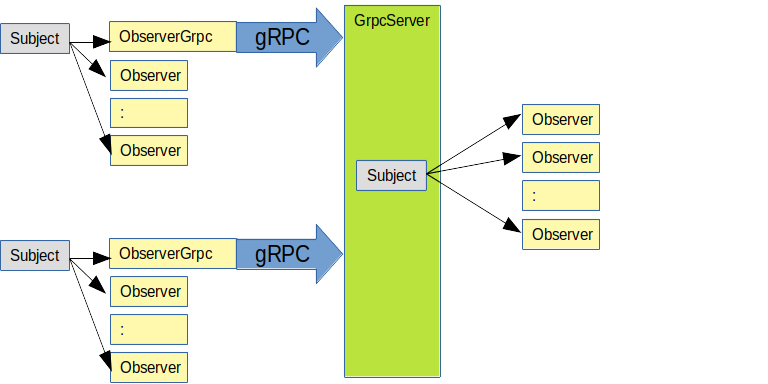

# go-observing

## Synopsis

Implements the
[Observer](https://en.wikipedia.org/wiki/Observer_pattern)
software design pattern.

[](https://pkg.go.dev/github.com/senzing/go-observing)
[](https://goreportcard.com/report/github.com/senzing/go-observing)
[](https://github.com/Senzing/go-observing/actions/workflows/go-test.yaml)

## Overview

Examples of using `go-observing` can be seen in
[main.go](main.go).

As an example, a null object,
[ObserverNull](observer/observer_null.go),
shows how an observer is used in the Observer software design pattern.
It is an example only.
Any code wishing to observe, would write their own code
which adheres to the
[Observer](observer/main.go)
interface.

## gRPC Server

The `go-observer` repository also supports a gRPC-based aggregator of observer messages.

The following image shows flow of messages.



The Subject notifies local Observers.  One of the Observers "repeats"
the message by sending it via gRPC to a GrpcServer that embeds a Subject.
That Subject notifies remote Observers.

To create a GrpcServer, a Subject is created with Observers and wrapped with a GrpcServer.
Example:

```go

package main

import (
 "context"

 "github.com/senzing/go-observing/grpcserver"
 "github.com/senzing/go-observing/observer"
 "github.com/senzing/go-observing/subject"
)

func main() {
    ctx := context.TODO()

    // Create a Subject.

    aSubject := &subject.SubjectImpl{}

    // Register an observer.

    anObserver1 := &observer.ObserverNull{
        Id: "Observer 1",
    }
    err = aSubject.RegisterObserver(ctx, anObserver1)
    if err != nil {
        fmt.Print(err)
    }

    // Start gRPC service.

    aGrpcServer := &grpcserver.GrpcServerImpl{
        Port:    8260,
        Subject: aSubject,
    }
    aGrpcServer.Serve(ctx)
```

## References

- [Development](docs/development.md)
- [Errors](docs/errors.md)
- [Examples](docs/examples.md)
- [Package reference](https://pkg.go.dev/github.com/senzing/go-observing)
